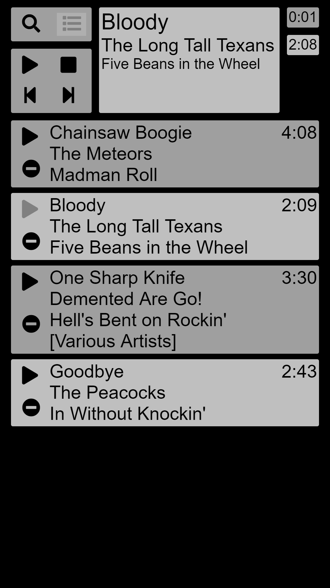
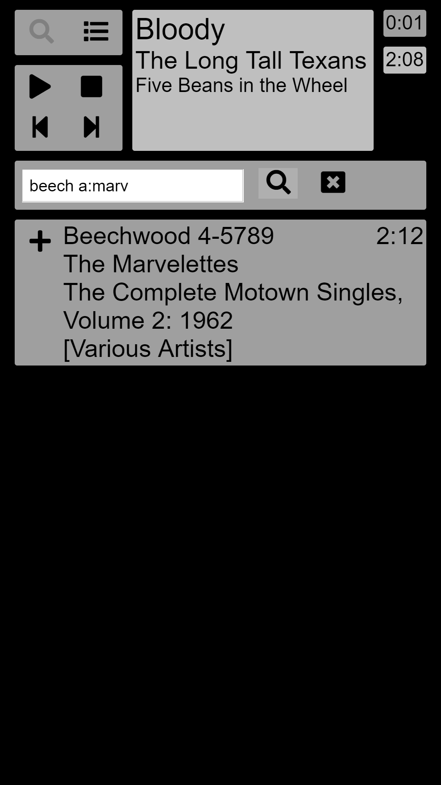

# Web MPC

A small web client for [MPD](https://www.musicpd.org/) written in [go](https://linkhttps://golang.org/) using websockets.

At the moment it has 2 views:

## Playlist View

Showing the currently active playlist aka the queue.  You can start playing songs from the queue by clicking on the play button or remove the song by clicking on the minus in the circle.

## Search View

Enter the search query in the input field.  The text will be split into tokens separated by whitespaces.  Every token will be fed to MPD as *any* search.  There are 3 prefixes available:

- *t:* to search for *title*
- *a:* to search for *artist*
- *al:* to search for *album*

Click on the search icon to submit the search.  Click on the plus icon to add the song to the queue.

## Installation

The HTML, JS and CSS files are included in the binary with [packr](https://github.com/gobuffalo/packr).  To build web-mpc you need to install packr first:

`go get -u github.com/gobuffalo/packr/packr`

The build it with:

`packr2 build`

And finally run it with:

`./web-mpc -addr :8080 -mpd 127.0.0.1:6600`

- *-addr* specifies the interface the HTTP server listens ons.  Use `127.0.0.1:1234` to only list on localhost.  User `:1234` to listen on all interfaces.  Default is `:6666`
- *-mpd* specifies the IP address and port the MPD server listens on.  Use *-pass* if you need to provide a password.  Default is `127.0.0.1:6600`.

#### eof